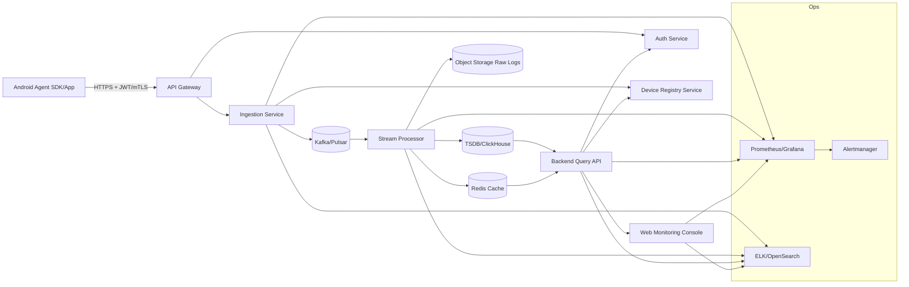
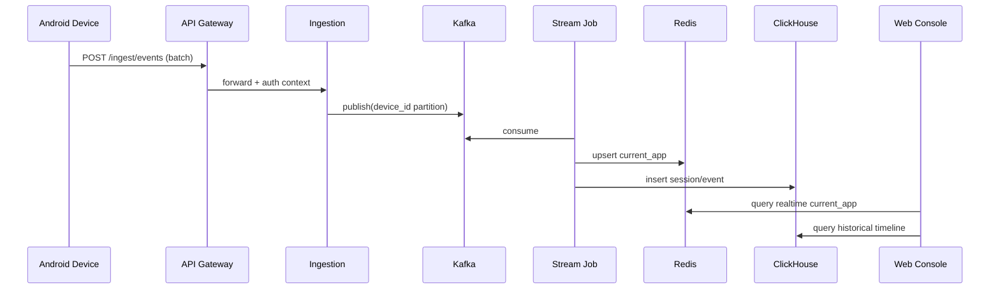

# 安卓应用运行探测与监控平台架构设计

## 1. 目标与范围

本方案设计一个“端 + 云 + Web 控制台”的完整系统，用于：

1. 在安卓手机端采集“当前运行/活跃应用”信息（含前台切换、近期活跃统计等）。
2. 将采集结果可靠上报至监控服务端。
3. 在监控端页面中进行实时/准实时展示与历史分析。
4. 具备可扩展性、安全性、低功耗与合规能力（用户授权、最小化采集）。

> 说明：Android 对“后台读取其它应用运行状态”限制严格，需基于合法权限与用途实现（Usage Access、Accessibility 事件、前台服务等），并符合隐私政策与应用市场规范。

---

## 2. 总体架构



### 2.1 逻辑分层

- **采集层（Android Agent）**：事件监听、数据聚合、离线缓存、压缩加密上报。
- **接入层（Gateway + Ingestion）**：鉴权、限流、幂等、批量写入消息队列。
- **计算层（Stream Processor）**：去重、会话化、指标聚合、异常检测。
- **存储层（热+冷）**：Redis（实时视图）、ClickHouse/TSDB（历史查询）、对象存储（原始日志归档）。
- **展示层（Web Console）**：实时列表、设备详情、时间线、Top App 排行、告警面板。
- **运维安全层**：监控、日志、告警、审计、密钥管理。

---

## 3. Android 端设计

## 3.1 采集能力组合（建议分级）

1. **基础方案（推荐默认）**：
   - `PACKAGE_USAGE_STATS`（Usage Access）
   - 周期拉取 `UsageStatsManager` + `queryEvents`
   - 获取前台切换与应用活跃时长（近实时，精度中等）

2. **增强方案（可选）**：
   - `AccessibilityService` 监听窗口变化事件（高实时）
   - 适用于企业内管控场景（需强授权提示与合规评估）

3. **补充能力**：
   - `ACTIVITY_RECOGNITION`（可选，用于人机状态判定）
   - 电量、网络、设备状态辅助字段

## 3.2 Android 组件划分

- `CollectorService`：前台服务，负责调度采集任务。
- `UsageEventReader`：读取 `UsageEvents`，转换为统一事件。
- `AccessibilityEventReader`（可选模块）：监听窗口变化实时事件。
- `SessionAggregator`：将离散事件聚合为应用会话（start/end/duration）。
- `LocalQueue`：SQLite/Room 持久化待上传数据。
- `Uploader`：批量压缩、签名、重试上传。
- `PolicyManager`：下发配置（采样率、上传间隔、黑白名单）。

## 3.3 端上数据模型

```json
{
  "event_id": "uuid-v7",
  "device_id": "hashed_android_id",
  "user_id": "optional_enterprise_uid",
  "package_name": "com.example.app",
  "app_label": "Example",
  "event_type": "APP_FOREGROUND|APP_BACKGROUND|HEARTBEAT",
  "ts": 1760000000123,
  "duration_ms": 23000,
  "network": "WIFI|CELL",
  "battery": 0.82,
  "os_version": "14",
  "sdk_int": 34,
  "source": "USAGE_STATS|ACCESSIBILITY",
  "trace_id": "..."
}
```

## 3.4 关键实现细节

- **低功耗策略**：
  - 前台服务 + 自适应轮询（屏亮/解锁时高频；熄屏低频）。
  - WorkManager 做兜底上报，不做高频实时。
- **离线可靠性**：
  - Room 队列按批次确认 ACK 删除。
  - 指数退避重试（1s/2s/4s...上限 15m）。
- **幂等与去重**：
  - `event_id` 全局唯一；服务端按 `(device_id,event_id)` 幂等。
- **时间准确性**：
  - 记录 `device_ts` 与 `server_received_ts`，便于时钟漂移校正。

---

## 4. 服务端设计

## 4.1 API 设计

### 采集上报接口

- `POST /api/v1/ingest/events`
- Headers: `Authorization: Bearer <token>`, `X-Device-Id`, `X-Signature`
- Body: gzip + json array（建议 100~500 条/批）

返回：

```json
{
  "accepted": 490,
  "duplicated": 10,
  "rejected": 0,
  "server_time": 1760000000999
}
```

### 监控查询接口

- `GET /api/v1/devices/{id}/timeline?from=&to=`
- `GET /api/v1/apps/top?scope=device|group&window=1h`
- `GET /api/v1/realtime/active?group_id=`（可走 WebSocket/SSE）

## 4.2 数据流处理

1. Ingestion 校验签名、token、字段合法性。
2. 写入 Kafka Topic（按 `device_id` 分区，保持设备内有序）。
3. 流处理作业：
   - 去重（状态表/布隆过滤器 + 短期 Redis）
   - 会话拼接（foreground/background）
   - 指标聚合（1min/5min）
4. 输出：
   - Redis：最新活动 app（秒级查询）
   - ClickHouse：历史明细+聚合
   - 对象存储：原始归档（审计/回放）

## 4.3 存储模型建议

### ClickHouse 表（示例）

- `app_events_raw`
  - 主键：`(event_date, device_id, ts)`
  - 分区：`toYYYYMM(event_date)`
- `app_sessions`
  - 字段：`device_id, package_name, start_ts, end_ts, duration_ms`
- `agg_app_usage_1m`
  - 字段：`minute_bucket, package_name, active_devices, total_duration_ms`

### Redis Key（示例）

- `device:{id}:current_app` -> `{"pkg":"...","ts":...}` TTL 10m
- `group:{id}:active_devices` -> Sorted Set

---

## 5. Web 监控端设计

## 5.1 页面结构

1. **实时总览**
   - 在线设备数、活跃应用 TopN、事件吞吐、延迟分位数。
2. **设备详情**
   - 当前应用卡片、最近切换时间线、最近 24h 使用分布图。
3. **应用画像**
   - 按应用查看活跃设备趋势、平均停留时长、峰值时段。
4. **告警中心**
   - 规则：异常应用出现、黑名单命中、静默设备超时。

## 5.2 前端技术建议

- React + TypeScript + Ant Design（或 Vue3 + Element Plus）
- 图表：ECharts
- 实时通道：SSE（简单）或 WebSocket（双向）
- 状态管理：Redux Toolkit/Pinia

## 5.3 查询性能

- 列表接口默认分页 + 时间窗口限制。
- 高并发榜单走预聚合表（1m/5m）而非实时扫明细。
- 热点设备详情可加 API 缓存（5~15s）。

---

## 6. 安全与合规

- **最小化采集原则**：仅采包名/时长/时间戳，不采内容数据。
- **传输安全**：TLS1.2+，可升级 mTLS（企业设备）。
- **设备身份**：首次注册发放 device token，周期轮换。
- **隐私合规**：首次启动明确告知用途与权限，支持用户撤回。
- **访问控制**：RBAC（组织/项目/设备分级授权）。
- **审计**：所有查询与导出行为写审计日志。

---

## 7. 可靠性与可运维性

- SLO 示例：
  - 事件接收成功率 >= 99.9%
  - P95 端到端展示延迟 <= 10s
- 灰度发布：
  - 按设备分组灰度新采样策略
- 灾备：
  - Kafka 多副本、ClickHouse 副本分片、对象存储跨区
- 监控指标：
  - ingest_qps, ingest_error_rate, queue_lag, ws_connections, dashboard_p95

---

## 8. MVP 分阶段落地

## Phase 1（2~4 周）

- Android：UsageStats 采集 + 本地队列 + 批量上传
- 服务端：Ingestion + ClickHouse 落库 + 基础查询 API
- Web：设备列表 + 设备时间线 + Top 应用

## Phase 2（4~8 周）

- 实时通道（SSE/WebSocket）
- Redis 热缓存 + 聚合作业
- 告警规则引擎（简单阈值）

## Phase 3（8 周+）

- Accessibility 增强采集（可配置）
- 多租户/RBAC 完整权限体系
- 智能分析（异常行为模型）

---

## 9. 风险与应对

1. **Android 权限限制导致采集不稳定**
   - 多源融合（Usage + Accessibility 可选）
   - 明确引导权限开启与健康检查页
2. **电量消耗增加**
   - 动态采样 + 批量上传 + 熄屏降频
3. **数据量突增**
   - 网关限流 + 消息队列削峰 + 预聚合
4. **合规风险**
   - 文档化授权、数据脱敏、留存周期管理

---

## 10. 建议的代码仓结构（Monorepo）

```text
AppRadar/
  android-agent/
    app/
    collector/
    uploader/
  backend/
    gateway/
    ingestion/
    query-api/
    stream-jobs/
  web-console/
  infra/
    k8s/
    helm/
    terraform/
  docs/
    android-app-detection-architecture.md
```

---

## 11. 样例时序（设备上报到页面展示）



